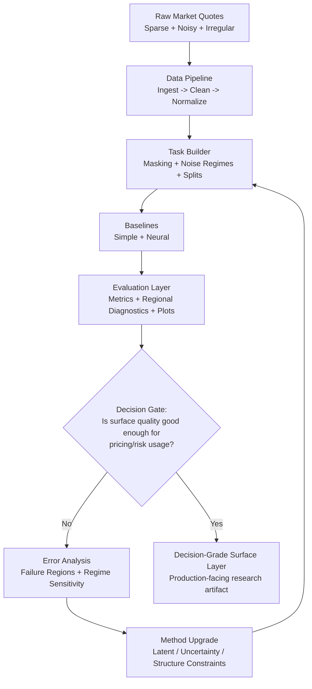
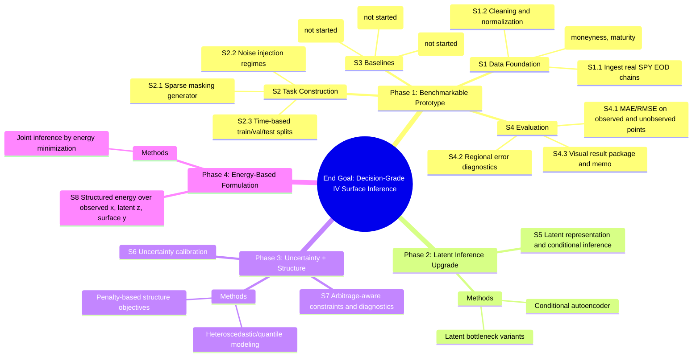

# Neural IV Surface Inference - Structural Roadmap

_Last updated: 2026-04-02_

## 1) End Goal (Decision-Grade Output)

Build an inference system that turns sparse/noisy/irregular option observations into a **decision-grade implied-volatility surface representation** for:
- pricing
- hedging
- risk monitoring
- relative value and scenario analysis

Core quality targets:
- stable and smooth surface behavior
- uncertainty awareness
- arbitrage-aware structure checks
- reproducible benchmark workflow

---

## 2) How Pieces Work Together (High-Level Flow)

---

## 3) Task Decomposition Roadmap (Goal -> Subtasks -> Methods)

---

## 4) Subtask-to-Method Matrix

| Subtask ID | Subtask | Method / Implementation Path | Current Status |
|---|---|---|---|
| S1.1 | Ingest real options data | scripted ingestion, Parquet snapshotting | Completed |
| S1.2 | Clean and normalize | quality filters, derived features, conservative/strict subsets | Completed |
| S1.3 | Surface coordinates | moneyness + maturity representation | Completed |
| S2.1 | Sparse observations | random + structured + realistic liquidity masking | Completed — `data/masking.py`, 32 tests |
| S2.2 | Noisy observations | none/low/med/high + heteroscedastic noise | Completed — `data/noise.py`, tested |
| S2.3 | Evaluation splits | chronological 70/15/15 + benchmark versioning | Completed — `data/splits.py`, tested |
| S3.1 | Simple baseline | per-date RBF/griddata interpolation on observed points | Completed — `models/interpolation.py`, tested |
| S3.2 | Neural baseline | global masked MLP (SiLU + LayerNorm + softplus output) | Completed — `models/baseline_mlp.py`, `training/train.py`, tested |
| S3.3 | Vendor-style reference | external reference integration and alignment | Not Started |
| S4.1 | Core metrics | MAE/RMSE/MAPE, observed vs unobserved split | Completed — `training/eval.py`, tested |
| S4.2 | Regional diagnostics | by maturity bucket (short/med/long) + moneyness bucket (5 bins) | Completed — `training/eval.py`, tested |
| S4.3 | Result artifact | plots + summary table + phase memo | Not Started — `run_baseline.py` produces CSV, plots/memo not yet generated |
| S5 | Latent inference | conditional autoencoder / latent bottleneck | Planned |
| S6 | Uncertainty layer | predictive uncertainty/calibration | Planned |
| S7 | Structure constraints | arbitrage diagnostics + structure-aware losses | Planned |
| S8 | Full EBM stage | structured energy-based inference | Planned |

---

## 5) What Each Existing Work Item Already Fulfilled

| Existing Work Item | What It Fulfilled |
|---|---|
| `src/data/01–03_*.py` + `src/data/config.py` | S1.1, S1.2, S1.3 — data ingestion, cleaning, coordinate mapping |
| `src/neural_iv_surface_inference/data/masking.py` | S2.1 — sparse observation masking (7 strategies) |
| `src/neural_iv_surface_inference/data/noise.py` | S2.2 — noise injection (4 regimes + heteroscedastic) |
| `src/neural_iv_surface_inference/data/splits.py` | S2.3 — chronological splits + benchmark versioning |
| `src/data/04_build_benchmark_tasks.py` + `configs/benchmark_tasks.yaml` | S2.1–S2.3 orchestration (11 variants) |
| `tests/test_task_construction.py` | 32 unit tests covering masking, noise, splits, save/load |
| `models/interpolation.py` | S3.1 — per-date RBF/griddata interpolation baseline |
| `models/baseline_mlp.py` + `models/losses.py` | S3.2 — masked MLP with softplus output + masked MSE/MAE losses |
| `training/train.py` | S3.2 training loop with early stopping, checkpointing, LR scheduling |
| `training/eval.py` | S4.1, S4.2 — MAE/RMSE/MAPE + regional diagnostics by maturity and moneyness |
| `data/loaders.py` | IVSurfaceDataset + DataLoader factory for benchmark Parquets |
| `scripts/run_baseline.py` | Entry point: runs both baselines, compares, saves CSV |
| `tests/test_baselines.py` | 25 unit tests covering model, losses, dataset, training, eval, end-to-end |
| `configs/baseline.yaml` | Full config for interpolation + MLP + paths |
| `docs/logs/progress_log.md` + phase action plan | execution traceability and task-level accountability |

---

## 6) Decision Rules (Readable, Practical)

1. **If baseline quality is unstable across sparsity/noise regimes** -> prioritize Phase 2 latent inference.
2. **If point estimates are good but reliability is unclear** -> prioritize Phase 3 uncertainty calibration.
3. **If fit improves but structure risk rises (arbitrage-like artifacts)** -> prioritize Phase 3 structure constraints.
4. **If modular upgrades still fail to unify objectives** -> escalate to Phase 4 structured energy formulation.

---

## 7) Next Milestone Priorities

1. Integrate true vendor-style reference stream (close S3.3 gap).
2. Promote MLP baseline to conditional autoencoder (Phase 2 entry point).
3. Add first uncertainty-aware output head and calibration diagnostics.
4. Add lightweight arbitrage diagnostics to evaluation reports.

